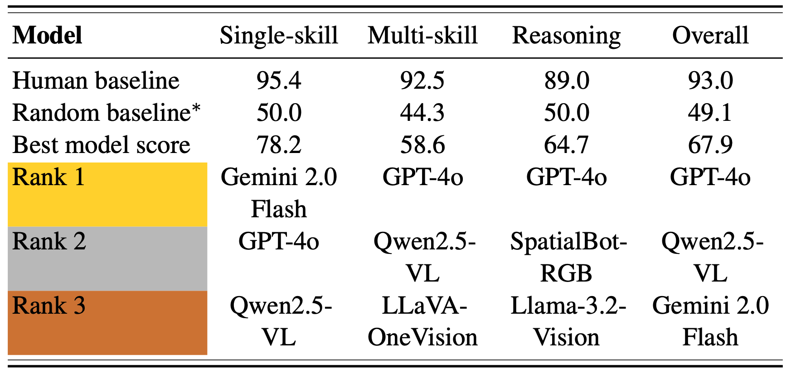

# SPHERE: Unveiling Spatial Blind Spots in Vision-Language Models Through Hierarchical Evaluation

📖 [arxiv](https://arxiv.org/pdf/2412.12693) / 🤗 [Huggingface](https://huggingface.co/papers/2412.12693) / 🤗 [Huggingface Dataset](https://huggingface.co/datasets/wei2912/SPHERE-VLM)
______________________________________________________________________

[SPHERE (Spatial Perception and Hierarchical Evaluation of REasoning)](https://arxiv.org/pdf/2412.12693) is a benchmark for assessing spatial reasoning in vision-language models. It introduces a hierarchical evaluation framework with a human-annotated dataset, testing models on tasks ranging from basic spatial understanding to complex multi-skill reasoning. SPHERE poses significant challenges for both state-of-the-art open-source and proprietary models, revealing critical gaps in spatial cognition, including:
- 📏 Size Constancy: Difficulty in recognizing that an object’s size remains unchanged despite variations in distance or perspective.
- 🧭 Egocentric vs. Allocentric Perspectives: Struggles in interpreting spatial relationships from different viewpoints.
- 🧩 Spatial Logic & Physical Reasoning: Limitations in inferring an object's existence, position, and state based on occlusions, viewpoint changes, and interactions with the environment.

Evaluated models: Phi-3.5-Vision, LLaVA-NeXT, LLaVA-OneVision, Qwen2-VL, InstructBLIP, Idefics2, InternVL2.5, Qwen-VL, Llama-3.2-Vision, Gemini 2.0 Flash, GPT-4o, SpatialBot, SpaceMantis, SpatialRGPT.

<p align="center">
  
</p>

<p align="center">
  
</p>


## 🛠️ Installation

### Data
Download COCO test set:
```bash
wget http://images.cocodataset.org/zips/test2017.zip
```
Rename to `datasets/coco_test2017`. The SPHERE annotations are in `datasets/coco_test2017_annotations`.

### Environment
Use docker image:
`docker://nvcr.io/nvidia/pytorch:24.09-py3` and set `export PYTHONNOUSERSITE=1`

Install/upgrade packages:
```bash
conda create -n SPHERE
conda activate SPHERE
conda install pytorch torchvision torchaudio pytorch-cuda=12.4 -c pytorch-nightly -c nvidia
conda install --file requirements.txt
pip install transformers_stream_generator==0.0.5
pip install flash-attn --no-build-isolation
pip install qwen-vl-utils==0.0.8
```

To run close-source models by API, set the appropriate API keys and install packages:
```bash
pip install google-generativeai==0.8.4
pip install openai==1.16.1
```

### Model dependencies

The following models are commented out in `models/__init__.py` as additional installations are needed.
Download the the model repositories and place them in `models/utils`.
- SpaceMantis: https://huggingface.co/remyxai/SpaceMantis
- SpatialRGPT: https://github.com/AnjieCheng/SpatialRGPT

```bash
git clone https://huggingface.co/remyxai/SpaceMantis
git clone https://github.com/AnjieCheng/SpatialRGPT
```

Note: SpatialRGPT requires an environment setup which may not be compatible with other models. Suggestion is to set up a separate environment following instructions in the SpatialRGPT GitHub repository to evaluate SpatialRGPT.

## 📊 Evaluation

Model evaluation scripts are in `scripts`. Execute `scripts/all_expts.sh` to run all models, and `scripts/all_supplement.sh` to perform additional analysis such as allocentric vs. allocentric viewpoints and intermediate vs. final reasoning questions.

Overall results will be saved in `eval_datasets/coco_test2017_annotations/results.json`. Individual model responses will be saved in `datasets/coco_test2017_annotations` for each task, in files ending with `_w_predictions`.

## 📂 Repository overview
```
SPHERE-VLM/
│
├── eval_datasets/
│   └── __init__.py
│   └── coco_dataset.py
│   └── coco_test2017/
│   └── coco_test2017_annotations/
│
├── models/
│   └── __init__.py
│   └── model_interface.py
│   └── vision_language_models/
│   └── utils/
│
├── tasks/
│   └── __init__.py
│   └── space_vqa.py
│   └── utils.py
│   └── metrics.py
│   └── combine_intermediate.py
│
├── scripts/
|
├── main.py
├── main_combine_intermediate.py
├── main_process_results.py	
├── README.md
└── requirements.txt
```

## 📝 Citation

```bibtex
@article{zhang2025sphere,
    author = {Zhang, Wenyu and Ng, Wei En and Ma, Lixin and Wang, Yuwen and Zhao, Junqi and Koenecke, Allison and Li, Boyang and Wang, Lu},
    year = {2025},
    title = {{SPHERE: Unveiling Spatial Blind Spots in Vision-Language Models Through Hierarchical Evaluation}},
    journal = {arXiv},
}
```
